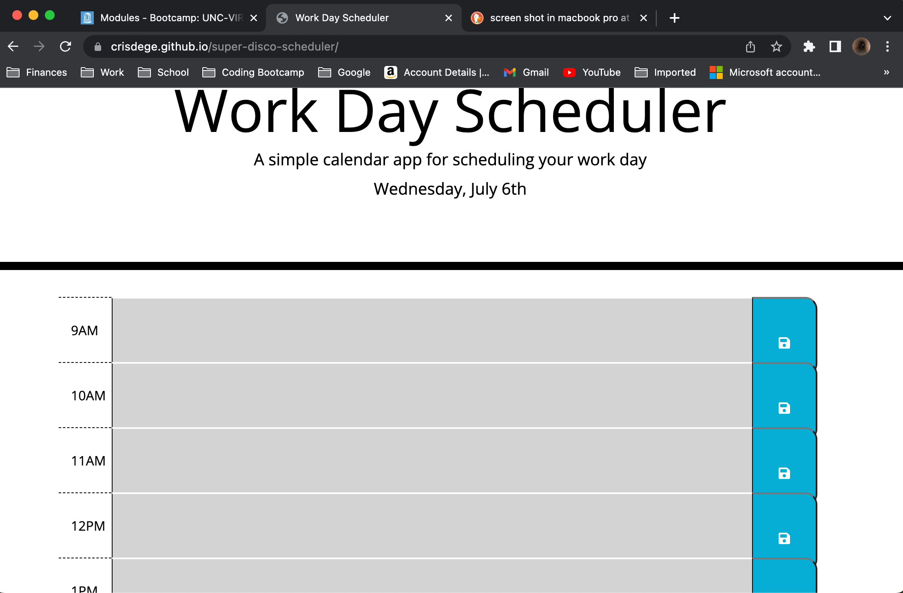

# super-disco-scheduler

This app is a simple work day scheduler. It's features include block times that turn gray if in the past, red during the current hour, and green for future times. It also showes the user the current day, and the user is able to save the appointments, and retrieve them from local storage.

https://crisdege.github.io/super-disco-scheduler/

